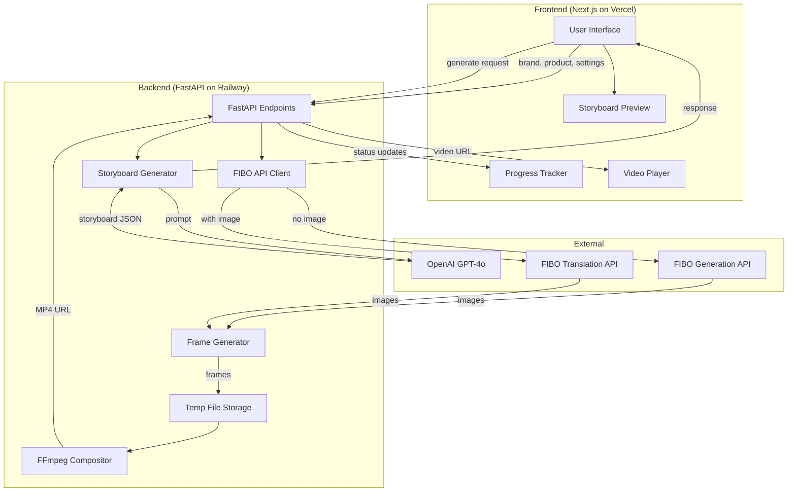

# FabFlow Studio - Design Document

## Overview

FabFlow Studio is a web-based prototype that transforms brand/product information into short Instagram-ready ad videos using AI. The system follows a pipeline architecture: user input → LLM storyboard generation → FIBO prompt translation → frame generation → video compositing.

For this hackathon prototype, we prioritize a working end-to-end pipeline over production-grade features. The tech stack is:
- **Frontend**: Next.js with React (TypeScript) - deployed on Vercel
- **Backend**: Python FastAPI - deployed on Railway/Render (handles FIBO API + FFmpeg)
- **LLM**: OpenAI GPT-4o for storyboard generation (called from FastAPI)
- **Image Generation**: Bria FIBO API
- **Video Processing**: FFmpeg for compositing (runs on FastAPI server)

## Architecture



## Components and Interfaces

### Frontend (Next.js/TypeScript)

#### 1. User Input Component

Handles user data collection and client-side validation.

```typescript
interface UserInput {
  brandName: string;
  productName: string;
  productDescription: string;
  productImage?: File | null;
  duration: 5 | 6 | 7 | 8 | 9 | 10 | 11 | 12;
  aspectRatio: '9:16' | '1:1' | '16:9';
}

interface ValidationResult {
  isValid: boolean;
  errors: string[];
}

function validateUserInput(input: Partial<UserInput>): ValidationResult;
```

### Backend (FastAPI/Python)

#### 2. Storyboard Generator (FastAPI)

Calls OpenAI GPT-4o to generate storyboards in FIBO-compatible JSON format using Pydantic models.

```python
from pydantic import BaseModel
from typing import Literal, Optional
from openai import OpenAI

class FIBOPrompt(BaseModel):
    prompt: str  # Detailed scene description for FIBO
    camera_angle: Literal['close-up', 'medium-shot', 'wide-shot', 'overhead', 'low-angle']
    lighting_style: Literal['soft', 'dramatic', 'natural', 'studio', 'golden-hour']
    subject_position: Literal['center', 'rule-of-thirds-left', 'rule-of-thirds-right']
    color_palette: Optional[list[str]] = None  # hex colors
    mood: Optional[str] = None

class Scene(BaseModel):
    scene_number: int
    duration: float  # seconds
    transition: Literal['fade', 'dissolve', 'cut', 'slide']
    fibo_prompt: FIBOPrompt

class Storyboard(BaseModel):
    brand_name: str
    product_name: str
    total_duration: int
    aspect_ratio: Literal['9:16', '1:1', '16:9']
    scenes: list[Scene]

class UserInput(BaseModel):
    brand_name: str
    product_name: str
    product_description: str
    duration: int  # 5-12 seconds
    aspect_ratio: Literal['9:16', '1:1', '16:9']
    product_image_url: Optional[str] = None

async def generate_storyboard(input: UserInput) -> Storyboard:
    """Uses OpenAI with response_format for structured output"""
    pass
```

#### 3. FIBO API Client (FastAPI)

Handles FIBO API calls with async polling for results.

```python
import httpx
import asyncio
from typing import Optional

class FIBOClient:
    BASE_URL = "https://engine.prod.bria-api.com/v1"
    
    def __init__(self, api_key: str):
        self.api_key = api_key
        self.headers = {"api_token": api_key}
    
    async def generate_image(
        self,
        prompt: str,
        aspect_ratio: str = "9:16",
        num_results: int = 1
    ) -> str:
        """Call /text-to-image endpoint, poll for result, return image URL"""
        pass
    
    async def generate_with_reference(
        self,
        image_url: str,
        prompt: Optional[str] = None,
        aspect_ratio: str = "9:16"
    ) -> str:
        """Call translation endpoint with reference image"""
        pass
    
    async def poll_status(self, request_id: str, status_url: str) -> str:
        """Poll status endpoint every 2 seconds until complete"""
        pass
```

#### 4. Frame Generator (FastAPI)

Generates frames for each scene using FIBO API.

```python
from pathlib import Path
import aiofiles

class GeneratedFrame(BaseModel):
    scene_number: int
    frame_index: int
    image_url: str
    local_path: str

class FrameGenerationResult(BaseModel):
    success: bool
    frames: list[GeneratedFrame]
    errors: list[str]

async def generate_frames_for_scene(
    scene: Scene,
    aspect_ratio: str,
    fibo_client: FIBOClient,
    output_dir: Path,
    reference_image_url: Optional[str] = None
) -> FrameGenerationResult:
    """
    Generate frames for a scene.
    For MVP: 1 frame per scene (FIBO generates key frame)
    Downloads image and saves to local storage for FFmpeg
    """
    pass

def calculate_frame_count(duration: float, fps: int = 24) -> int:
    """Calculate number of frames needed for scene duration"""
    return max(1, int(duration * fps))
```

#### 5. Compositing Engine (FastAPI)

Assembles frames into final video using FFmpeg.

```python
import subprocess
from pathlib import Path

class CompositeResult(BaseModel):
    success: bool
    video_path: str
    video_url: str
    duration: float
    error: Optional[str] = None

async def composite_video(
    frames: list[GeneratedFrame],
    storyboard: Storyboard,
    output_dir: Path
) -> CompositeResult:
    """
    Use FFmpeg to:
    1. Scale frames to correct aspect ratio
    2. Create video from frames with scene durations
    3. Apply transitions between scenes (optional)
    4. Output MP4 file
    """
    pass

def get_dimensions_for_aspect_ratio(aspect_ratio: str) -> tuple[int, int]:
    """Return (width, height) for aspect ratio"""
    ratios = {
        "9:16": (1080, 1920),  # Vertical/Stories
        "1:1": (1080, 1080),   # Square
        "16:9": (1920, 1080),  # Horizontal
    }
    return ratios.get(aspect_ratio, (1080, 1920))
```

#### 6. FastAPI Endpoints

```python
from fastapi import FastAPI, HTTPException, BackgroundTasks
from fastapi.middleware.cors import CORSMiddleware

app = FastAPI(title="FabFlow Studio API")

# Enable CORS for Next.js frontend
app.add_middleware(CORSMiddleware, allow_origins=["*"], allow_methods=["*"])

@app.post("/api/generate-storyboard")
async def generate_storyboard_endpoint(input: UserInput) -> Storyboard:
    """Generate storyboard from user input using OpenAI"""
    pass

@app.post("/api/generate-video")
async def generate_video_endpoint(
    input: UserInput,
    background_tasks: BackgroundTasks
) -> dict:
    """
    Full pipeline: storyboard -> frames -> video
    Returns job_id for polling progress
    """
    pass

@app.get("/api/job/{job_id}/status")
async def get_job_status(job_id: str) -> dict:
    """Get progress of video generation job"""
    pass

@app.get("/api/job/{job_id}/result")
async def get_job_result(job_id: str) -> dict:
    """Get final video URL when job is complete"""
    pass
```

### Frontend Progress Tracker (Next.js)

```typescript
type PipelineStage = 
  | 'input'
  | 'storyboard'
  | 'frame-generation'
  | 'compositing'
  | 'complete'
  | 'error';

interface ProgressState {
  stage: PipelineStage;
  progress: number; // 0-100
  message: string;
  error?: string;
}

// Polls backend /api/job/{id}/status endpoint
function useJobProgress(jobId: string): ProgressState;
```

## Data Models

### Storyboard JSON Schema

```json
{
  "brandName": "string",
  "productName": "string",
  "totalDuration": "number",
  "aspectRatio": "string",
  "scenes": [
    {
      "sceneNumber": "number",
      "duration": "number",
      "description": "string",
      "cameraAngle": "string",
      "lighting": "string",
      "colorPalette": ["string"],
      "subjectPosition": "string",
      "transition": "string"
    }
  ]
}
```

### FIBO API Endpoints

**1. Structured Prompt Generate** - `/structured-prompt-generate`
For deterministic control using JSON structure (preferred for our use case):
```json
// Request
{
  "structured_prompt": {
    "scene_description": "string",
    "camera": {
      "angle": "string",
      "fov": "number"
    },
    "lighting": {
      "style": "string",
      "direction": "string"
    },
    "composition": {
      "subject_position": "string"
    },
    "style": {
      "color_palette": ["string"],
      "mood": "string"
    }
  },
  "num_results": 1,
  "aspect_ratio": "9:16",
  "sync": false
}
```

**2. Image Generate** - `/image-generate`
For simple text-to-image (fallback option):
```json
// Request
{
  "prompt": "string",
  "num_results": 1,
  "aspect_ratio": "9:16",
  "sync": false,
  "model_version": "2.3"
}
```

**3. Translation** (with reference image)
When user uploads product image, use translation to maintain visual consistency:
```json
// Request
{
  "image_url": "https://...",
  "prompt": "optional scene guidance",
  "num_results": 1,
  "aspect_ratio": "9:16",
  "sync": false
}
```

**Async Response** (all endpoints):
```json
{
  "request_id": "string",
  "status_url": "string"
}
```

**Status Complete Response**:
```json
{
  "status": "completed",
  "result": [
    {
      "url": "string"
    }
  ]
}
```

**Note:** The exact structured_prompt schema should be verified against the live API docs. The structure above is based on FIBO's documented capabilities for camera, lighting, composition, and style control.


## Error Handling

### Input Validation Errors
- Missing required fields: Return specific field names that are missing
- Invalid duration: Return message indicating valid range (5-12 seconds)
- Invalid aspect ratio: Return message with valid options
- Invalid image format: Return message with supported formats

### API Errors
- OpenAI API failure: Retry once, then show user-friendly error with retry option
- FIBO API failure: Retry up to 3 times with exponential backoff, then show error
- FIBO timeout: After 60 seconds of polling, show timeout error with retry option

### Processing Errors
- FFmpeg failure: Log detailed error, show generic "video processing failed" message
- File system errors: Log error, show "storage error" message with retry option

### Error Response Format
```typescript
interface ErrorResponse {
  success: false;
  error: {
    code: string;
    message: string;
    details?: string;
    retryable: boolean;
  };
}
```


