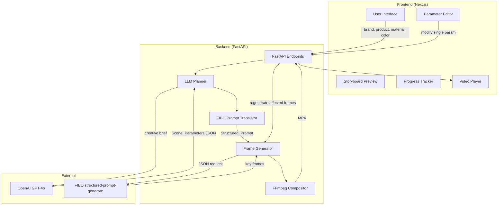

# FIBO JSON Pipeline - Design Document

## Overview

This design enhances FabFlow Studio to fully leverage FIBO's JSON-native architecture for professional-grade product ad video generation. The key innovation is **parameter-driven deterministic frame generation** - enabling real-time customization (material, color, angle changes) without full regeneration.

The enhancement focuses on:
1. **Structured JSON control** - precise camera, lighting, composition, material parameters
2. **Parameter isolation** - change one parameter → regenerate only affected frames
3. **Professional product shots** - e-commerce quality visuals, not simple images
4. **LLM-powered planning** - GPT-4o translates briefs into structured FIBO JSON

Tech stack remains:
- **Frontend**: Next.js 16 + TypeScript + Tailwind
- **Backend**: FastAPI + Pydantic
- **LLM**: OpenAI GPT-4o for structured JSON storyboard generation
- **Image Generation**: Bria FIBO API (structured-prompt-generate endpoint)
- **Video Processing**: FFmpeg for compositing

## Architecture



## Components and Interfaces

### 1. Enhanced User Input Model

Extended to capture material and color preferences for FIBO JSON control.

```python
from pydantic import BaseModel, Field
from typing import Literal, Optional

class EnhancedUserInput(BaseModel):
    """Enhanced user input with material and color control."""
    
    brand_name: str = Field(..., min_length=1)
    product_name: str = Field(..., min_length=1)
    product_description: str = Field(..., min_length=1)
    duration: int = Field(default=8, ge=5, le=12)
    aspect_ratio: Literal["9:16", "1:1", "16:9"] = "9:16"
    
    # New fields for FIBO JSON control
    material: Optional[Literal["fabric", "leather", "metal", "wood", "glass", "plastic", "ceramic"]] = None
    primary_color: Optional[str] = None  # hex color
    secondary_color: Optional[str] = None  # hex color
    style_mood: Optional[Literal["luxury", "minimal", "vibrant", "natural", "tech"]] = None
```

### 2. Scene Parameters Model

Structured parameters that map directly to FIBO JSON fields.

```python
class CameraParams(BaseModel):
    """Camera parameters for FIBO structured prompt."""
    angle: Literal["close-up", "medium-shot", "wide-shot", "overhead", "low-angle", "three-quarter"]
    shot_type: Literal["product_hero", "detail", "lifestyle", "context"]
    
class LightingParams(BaseModel):
    """Lighting parameters for FIBO structured prompt."""
    style: Literal["soft-studio", "dramatic", "natural-window", "golden-hour", "product-spotlight"]
    direction: Literal["front", "side", "back", "top", "ambient"]
    intensity: Literal["low", "medium", "high"] = "medium"

class CompositionParams(BaseModel):
    """Composition parameters for FIBO structured prompt."""
    subject_position: Literal["center", "rule-of-thirds-left", "rule-of-thirds-right"]
    background: Literal["solid", "gradient", "environment", "studio"]
    depth_of_field: Literal["shallow", "medium", "deep"] = "medium"

class StyleParams(BaseModel):
    """Style parameters for FIBO structured prompt."""
    color_palette: list[str]  # hex colors
    material: Optional[str] = None
    mood: str
    aesthetic: Literal["professional", "artistic", "commercial", "editorial"] = "professional"

class SceneParameters(BaseModel):
    """Complete scene parameters for FIBO JSON generation."""
    scene_number: int
    duration: float
    scene_description: str
    camera: CameraParams
    lighting: LightingParams
    composition: CompositionParams
    style: StyleParams
    transition: Literal["fade", "dissolve", "cut", "cross-dissolve"] = "cross-dissolve"
```

### 3. FIBO Structured Prompt Translator

Translates SceneParameters to FIBO API format.

```python
class FIBOStructuredPromptV2(BaseModel):
    """Enhanced structured prompt for FIBO API."""
    
    scene_description: str
    camera: dict
    lighting: dict
    composition: dict
    style: dict
    
    @classmethod
    def from_scene_parameters(cls, params: SceneParameters) -> "FIBOStructuredPromptV2":
        """Translate SceneParameters to FIBO structured prompt format."""
        return cls(
            scene_description=params.scene_description,
            camera={
                "angle": params.camera.angle.replace("-", "_"),
                "shot_type": params.camera.shot_type
            },
            lighting={
                "type": params.lighting.style.replace("-", "_"),
                "direction": params.lighting.direction,
                "intensity": params.lighting.intensity
            },
            composition={
                "subject_position": params.composition.subject_position.replace("-", "_"),
                "background": params.composition.background,
                "depth_of_field": params.composition.depth_of_field
            },
            style={
                "color_palette": params.style.color_palette,
                "material": params.style.material,
                "mood": params.style.mood,
                "aesthetic": params.style.aesthetic
            }
        )
    
    def to_api_payload(self, aspect_ratio: str = "9:16") -> dict:
        """Convert to FIBO API request payload."""
        return {
            "structured_prompt": {
                "scene_description": self.scene_description,
                "camera": self.camera,
                "lighting": self.lighting,
                "composition": self.composition,
                "style": self.style
            },
            "num_results": 1,
            "aspect_ratio": aspect_ratio,
            "sync": True
        }
```

### 4. Enhanced Storyboard Model

```python
class EnhancedStoryboard(BaseModel):
    """Storyboard with structured FIBO parameters."""
    
    brand_name: str
    product_name: str
    total_duration: int
    aspect_ratio: Literal["9:16", "1:1", "16:9"]
    scenes: list[SceneParameters]
    
    # Global parameters that can be modified for quick iteration
    global_material: Optional[str] = None
    global_color_palette: Optional[list[str]] = None
```

### 5. LLM Planner (Enhanced Storyboard Generator)

```python
ENHANCED_SYSTEM_PROMPT = """You are an expert advertising creative director specializing in e-commerce product videos.

Generate storyboards as structured FIBO JSON parameters for professional product photography.

For each scene, provide precise parameters:
- camera.angle: close-up, medium-shot, wide-shot, overhead, low-angle, three-quarter
- camera.shot_type: product_hero, detail, lifestyle, context
- lighting.style: soft-studio, dramatic, natural-window, golden-hour, product-spotlight
- lighting.direction: front, side, back, top, ambient
- composition.subject_position: center, rule-of-thirds-left, rule-of-thirds-right
- composition.background: solid, gradient, environment, studio
- style.color_palette: 2-4 hex colors
- style.material: fabric, leather, metal, wood, glass (if applicable)
- style.mood: descriptive mood

Create a visual progression:
1. Scene 1: Hero shot - dramatic product reveal
2. Scene 2-3: Detail shots - showcase features/materials
3. Scene 4-5: Lifestyle/context - product in use

Use incremental camera angle changes (+15° per scene) for smooth visual flow."""

async def generate_enhanced_storyboard(user_input: EnhancedUserInput) -> EnhancedStoryboard:
    """Generate storyboard with structured FIBO parameters."""
    # Uses OpenAI with JSON schema for structured output
    pass
```

### 6. Parameter Modification Service

Enables changing single parameters without full regeneration.

```python
class ParameterModification(BaseModel):
    """Request to modify a single parameter."""
    parameter_path: str  # e.g., "style.material" or "style.color_palette"
    new_value: Any
    apply_to_scenes: list[int]  # scene numbers to apply to, empty = all

class ModificationResult(BaseModel):
    """Result of parameter modification."""
    modified_scenes: list[int]
    frames_to_regenerate: list[int]
    preserved_parameters: dict

def apply_parameter_modification(
    storyboard: EnhancedStoryboard,
    modification: ParameterModification
) -> tuple[EnhancedStoryboard, list[int]]:
    """
    Apply a single parameter change to storyboard.
    Returns updated storyboard and list of scene numbers needing regeneration.
    """
    pass
```

### 7. Enhanced Frame Generator

```python
class EnhancedFrameGenerator:
    """Frame generator using FIBO structured prompts."""
    
    def __init__(self, fibo_client: FIBOClient):
        self.fibo_client = fibo_client
    
    async def generate_frame_for_scene(
        self,
        scene: SceneParameters,
        aspect_ratio: str
    ) -> GeneratedFrame:
        """Generate a single key frame using FIBO structured prompt."""
        structured_prompt = FIBOStructuredPromptV2.from_scene_parameters(scene)
        result = await self.fibo_client.generate_with_structured_prompt(
            structured_prompt,
            aspect_ratio
        )
        return GeneratedFrame(
            scene_number=scene.scene_number,
            image_url=result.image_url,
            parameters_hash=self._hash_parameters(scene)
        )
    
    async def regenerate_modified_frames(
        self,
        storyboard: EnhancedStoryboard,
        scenes_to_regenerate: list[int],
        existing_frames: dict[int, GeneratedFrame]
    ) -> dict[int, GeneratedFrame]:
        """Regenerate only the frames for modified scenes."""
        frames = existing_frames.copy()
        for scene_num in scenes_to_regenerate:
            scene = next(s for s in storyboard.scenes if s.scene_number == scene_num)
            frames[scene_num] = await self.generate_frame_for_scene(
                scene, storyboard.aspect_ratio
            )
        return frames
```

### 8. API Endpoints

```python
@app.post("/api/v2/generate-storyboard")
async def generate_storyboard_v2(input: EnhancedUserInput) -> EnhancedStoryboard:
    """Generate storyboard with structured FIBO parameters."""
    pass

@app.post("/api/v2/generate-video")
async def generate_video_v2(input: EnhancedUserInput) -> dict:
    """Full pipeline with structured FIBO JSON."""
    pass

@app.post("/api/v2/modify-parameter/{job_id}")
async def modify_parameter(
    job_id: str,
    modification: ParameterModification
) -> dict:
    """Modify a single parameter and regenerate affected frames."""
    pass

@app.get("/api/v2/job/{job_id}/parameters")
async def get_job_parameters(job_id: str) -> EnhancedStoryboard:
    """Get current storyboard parameters for a job."""
    pass
```

## Data Models

### FIBO Structured Prompt JSON Schema

```json
{
  "structured_prompt": {
    "scene_description": "Professional product shot of luxury leather handbag",
    "camera": {
      "angle": "three_quarter",
      "shot_type": "product_hero"
    },
    "lighting": {
      "type": "soft_studio",
      "direction": "front",
      "intensity": "medium"
    },
    "composition": {
      "subject_position": "center",
      "background": "studio",
      "depth_of_field": "shallow"
    },
    "style": {
      "color_palette": ["#8B4513", "#F5F5DC", "#2F2F2F"],
      "material": "leather",
      "mood": "luxury elegant sophisticated",
      "aesthetic": "professional"
    }
  },
  "num_results": 1,
  "aspect_ratio": "9:16",
  "sync": true
}
```

### Enhanced Storyboard JSON Schema

```json
{
  "brand_name": "string",
  "product_name": "string",
  "total_duration": 8,
  "aspect_ratio": "9:16",
  "global_material": "leather",
  "global_color_palette": ["#8B4513", "#F5F5DC"],
  "scenes": [
    {
      "scene_number": 1,
      "duration": 2.0,
      "scene_description": "string",
      "camera": {
        "angle": "close-up",
        "shot_type": "product_hero"
      },
      "lighting": {
        "style": "soft-studio",
        "direction": "front",
        "intensity": "medium"
      },
      "composition": {
        "subject_position": "center",
        "background": "studio",
        "depth_of_field": "shallow"
      },
      "style": {
        "color_palette": ["#8B4513"],
        "material": "leather",
        "mood": "luxury",
        "aesthetic": "professional"
      },
      "transition": "cross-dissolve"
    }
  ]
}
```


## Correctness Properties

*A property is a characteristic or behavior that should hold true across all valid executions of a system-essentially, a formal statement about what the system should do. Properties serve as the bridge between human-readable specifications and machine-verifiable correctness guarantees.*

### Property 1: Input Parameters Flow to Structured Prompt

*For any* valid user input with material, color, and aspect ratio specified, the generated Structured_Prompt SHALL contain those exact values in the corresponding fields.

**Validates: Requirements 1.2, 1.3, 1.5**

### Property 2: Duration Distribution Sums to Total

*For any* storyboard with total_duration D and scenes S1...Sn, the sum of all scene durations SHALL equal D (within 0.1 second tolerance).

**Validates: Requirements 1.4**

### Property 3: Scene Count Within Bounds

*For any* generated storyboard, the number of scenes SHALL be between 3 and 5 inclusive.

**Validates: Requirements 2.1**

### Property 4: Scene Parameters Have Valid Required Fields

*For any* SceneParameters object, all required fields (camera.angle, camera.shot_type, lighting.style, lighting.direction, composition.subject_position, style.color_palette, style.mood) SHALL be present and contain values from their respective allowed sets.

**Validates: Requirements 2.2, 2.3, 2.4**

### Property 5: Scene Parameters Round-Trip

*For any* valid SceneParameters object, serializing to JSON and parsing back SHALL produce an equivalent object.

**Validates: Requirements 2.6**

### Property 6: Translation Produces Valid Complete Structured Prompt

*For any* valid SceneParameters, translating to FIBOStructuredPrompt SHALL produce a prompt with all required FIBO fields (scene_description, camera, lighting, composition, style) populated.

**Validates: Requirements 3.1, 3.2, 3.3**

### Property 7: Structured Prompt Round-Trip

*For any* valid FIBOStructuredPrompt, serializing to API payload format and parsing back SHALL produce an equivalent prompt.

**Validates: Requirements 3.4**

### Property 8: Parameter Modification Preserves Unchanged Fields

*For any* storyboard and single parameter modification (e.g., changing material), all other parameters in the affected scenes SHALL remain identical to their original values.

**Validates: Requirements 4.1, 4.2, 4.3, 4.4**

### Property 9: Frame Count Equals Scene Count

*For any* storyboard with N scenes, frame generation SHALL produce exactly N key frames.

**Validates: Requirements 5.2**

### Property 10: Frames Are Ordered by Scene Number

*For any* generated frame list, frames SHALL be ordered by scene_number in ascending order.

**Validates: Requirements 5.4**

## Error Handling

### Input Validation Errors
- Missing required fields: Return specific field names
- Invalid material type: Return allowed values
- Invalid color format: Return expected hex format
- Invalid duration: Return valid range (5-12)
- Invalid aspect ratio: Return valid options

### Translation Errors
- Missing scene parameters: Log and return validation error
- Invalid enum values: Map to closest valid value or error

### FIBO API Errors
- 401 Unauthorized: Non-retryable, check API key
- 429 Rate Limited: Retry with exponential backoff
- 500 Server Error: Retry up to 3 times
- Timeout: Retry with increased timeout

### Error Response Format
```python
class ErrorResponse(BaseModel):
    success: bool = False
    error_code: str
    message: str
    details: Optional[dict] = None
    retryable: bool
```

## Testing Strategy

### Property-Based Testing Library
- **Python**: Hypothesis (https://hypothesis.readthedocs.io/)
- Configure minimum 100 iterations per property test

### Unit Tests
- Test individual model validation
- Test enum value mappings
- Test edge cases (min/max duration, empty color palette)

### Property-Based Tests

Each correctness property will be implemented as a Hypothesis property test:

1. **Input Parameter Flow**: Generate random valid inputs, verify parameters appear in output
2. **Duration Distribution**: Generate random durations, verify sum equals total
3. **Scene Count**: Generate storyboards, verify 3-5 scenes
4. **Scene Parameters Validation**: Generate random scenes, verify all fields valid
5. **Scene Parameters Round-Trip**: Generate random SceneParameters, serialize/deserialize, compare
6. **Translation Completeness**: Generate random SceneParameters, translate, verify all fields present
7. **Structured Prompt Round-Trip**: Generate random prompts, serialize/deserialize, compare
8. **Parameter Isolation**: Generate storyboard, modify one param, verify others unchanged
9. **Frame Count**: Generate storyboards, verify frame count equals scene count
10. **Frame Ordering**: Generate frames, verify ascending scene_number order

### Test Annotation Format
Each property test must include:
```python
# **Feature: fibo-json-pipeline, Property {N}: {property_name}**
# **Validates: Requirements X.Y**
```

### Integration Tests
- End-to-end storyboard generation with mock LLM
- Frame generation with mock FIBO API
- Video compositing with test frames
